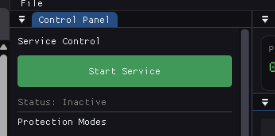
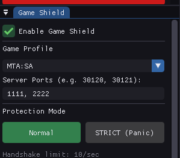
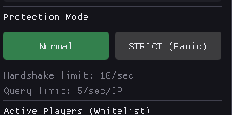

# 0rWinShield - Game Server Protection

**Tường lửa DDoS chuyên dụng cho Game Server** - FiveM, MTA:SA, CS2, Minecraft

## Tính năng

- 🎮 **Game Shield** - Bảo vệ tối ưu cho game server (BẬT MẶC ĐỊNH)
- 🛡️ **Whitelist Connection Tracking** - Chỉ cho phép IP đã handshake
- 📊 **Dashboard real-time** với biểu đồ live
- ⚡ **Hiệu năng cao** - Multi-threaded, lock-free
- 🔒 **Strict Mode** - Panic mode khi bị tấn công nặng
- 📝 **Packet Logger** - Mini Wireshark tích hợp

## Game Profiles Hỗ trợ

| Game | Port | Protocol |
|------|------|----------|
| FiveM/RedM | 30120 | UDP/RakNet |
| MTA:SA | 22003 | UDP/RakNet |
| CS2/Source | 27015 | UDP |
| Minecraft PE | 19132 | UDP/RakNet |
| Minecraft Java | 25565 | TCP |

## Yêu cầu

- Windows 10/11 64-bit
- **Quyền Administrator** (bắt buộc cho WinDivert driver)
- Visual Studio 2022 (nếu build từ source)

## Cài đặt Nhanh

### Chạy sẵn
1. Download `0rWinShield.exe` từ Release
2. Copy cùng thư mục với `WinDivert.dll` và `WinDivert64.sys`
3. **Chạy với quyền Admin!**

### Build từ Source
```powershell
# Clone và setup
cd d:\APP\0rWinShield
.\setup_deps.ps1

# Build
cmake -B build -G "Visual Studio 17 2022" -A x64
cmake --build build --config Release

# Chạy (Admin!)
.\build\bin\Release\0rWinShield.exe
```

## Hướng dẫn Sử dụng

### Bảo vệ FiveM Server (Mặc định)
1. Chạy 0rWinShield với quyền Admin
2. Game Shield đã bật sẵn với profile FiveM
3. Nhấn **Start Service** để bắt đầu bảo vệ
4. Các player kết nối sẽ tự động được whitelist


### Đổi Game
1. Mở panel **Game Shield**
2. Chọn game từ dropdown (CS2, Minecraft, v.v.)
3. Điều chỉnh port nếu cần


### Khi bị DDoS mạnh
1. Bật **STRICT Mode** (Panic)
2. Chỉ player đang chơi được tiếp tục
3. Block hoàn toàn kết nối mới
4. Tắt Strict khi attack dừng


## Cấu trúc

```
build\bin\Release\
├── 0rWinShield.exe   # Ứng dụng chính
├── WinDivert.dll     # Driver library
└── WinDivert64.sys   # Kernel driver
└── config.json       # Config
```

## Lưu ý

⚠️ **PHẢI chạy với quyền Admin** - Driver không thể load nếu không có quyền

⚠️ **Antivirus** có thể flag WinDivert - Thêm exception nếu cần

⚠️ **EMERGENCY STOP** - Dùng nếu lỡ block traffic của chính mình

## License

MIT License

## Credits

- [WinDivert](https://reqrypt.org/windivert.html) - Packet interception
- [Dear ImGui](https://github.com/ocornut/imgui) - GUI framework
- [ImPlot](https://github.com/epezent/implot) - Plotting
